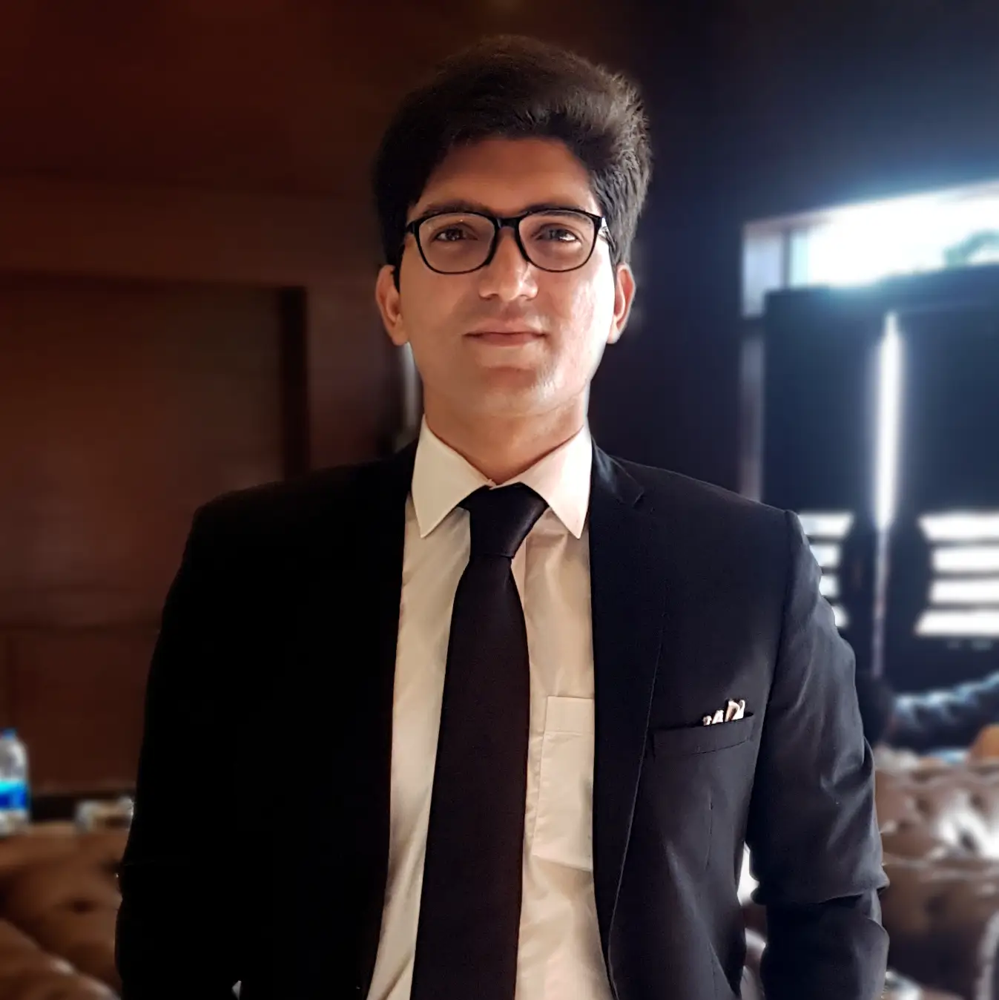
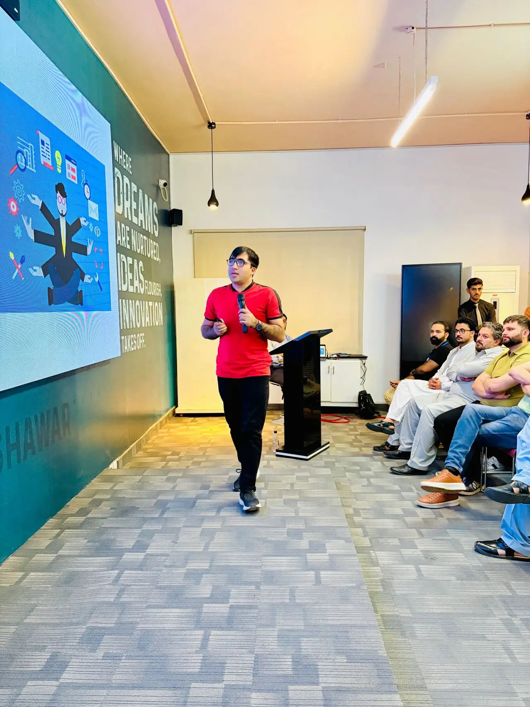

Hello! We welcome you to the Course: Advanced Full Stack Development & Software Testing TOT.

This advanced training program is designed to help you create full-stack applications. You'll start by establishing your environment and building a backend foundation using **Hono.js**. The program then shifts to the frontend, where you'll master Modern **React** Fundamentals and implement type-safe routing. We dive deep into API development and adding data persistence by integrating the serverless Cloudflare D1 SQL database. We then focus on connecting the React client to the Hono backend and securing the application with user registration and login.

Finally, we dedicate the last part of the course to professionalizing your skills by mastering Software Testing, deploying your full application to the Cloud, and concluding with a Capstone Project Workshop and Final Showcase.

## About Us

My name is Ehtisham Sajjad, and I am a Senior Software Engineer at Algosoft. I am a Microsoft Certified Expert, having passed the exams for AZ-204 Associate Developer and AZ-400 DevOps Expert. I have been developing applications professionally since 2020, and I hope today to share my learnings with you esteemed professionals.

Connect with me: [LinkedIn](https://www.linkedin.com/in/ehtishamsajjad/)

With me is Kashif Ali, a Solution Architect and Cloud & Virtualization Specialist. Over the past 13 years, he has trained over 10,000 students locally and globally, equipping them with real-world skills in Cloud Computing, Virtualization, Networking, and Cybersecurity.

Connect with him: [LinkedIn](https://www.linkedin.com/in/kashif-ali-vmware/)

## Ice Breaker

Let's get to know each other! Please introduce yourself by sharing:

1. **Name & Role:** Who are you and what do you do?
2. **Expectations:** What is one thing you hope to take away from this training?
3. **Fun Fact:** Something interesting about you (hobby, favorite food, travel destination, etc.).

## About the Project

We will create a Task Manager to assign tasks to users with different priorities, etc.

**GitHub Link:** [https://github.com/ehtishamsajjad/tm](https://github.com/ehtishamsajjad/tm)

**Live Project:** [https://tm.ehtishamsajjad.com/](https://tm.ehtishamsajjad.com/)
